# Database Project

###### *By Yehonatan Yeret && Maor Noy*

## Table of Contents

- [Phase 1 - Database Design & Implementation](#phase-1---database-design--implementation)
    - [Introduction](#introduction)
    - [ERD (Entity-Relationship Diagram)](#erd-entity-relationship-diagram)
    - [DSD (Data Structure Diagram)](#dsd-data-structure-diagram)
    - [SQL Scripts](#sql-scripts)
    - [Data Insertion](#data-insertion)
    - [Backup and Restore](#backup-and-restore)
- [Phase 2 - Queries](#phase-2---queries)
    - [Select Queries](#select-queries)
    - [Delete Queries](#delete-queries)
    - [Update Queries](#update-queries)
    - [Constraint Queries](#constraints)
    - [Backup and Restore](#backup-and-restore)

---

## Phase 1 - Database Design & Implementation

### Introduction

#### Project Overview

This project is part of a **Database Fundamentals Course** and focuses on designing, implementing, and managing a
structured database. The system is designed to store and process essential data efficiently while ensuring reliability
and accessibility.

#### Purpose of the Database

The primary goals of this project are:

- **Database Design**: Creating a well-structured relational database.
- **Efficient Data Storage**: Organizing data to allow quick retrieval and manipulation.
- **Data Integrity and Consistency**: Implementing constraints to maintain valid data.
- **Backup and Recovery**: Ensuring that data is not lost and can be restored when needed.

#### Key Functionalities

- **Data storage and retrieval** using SQL queries.
- **Relationships between tables** ensuring logical connections.
- **Simulating real-world scenarios** where database management is crucial.
- **Automation of data entry** using external tools.

---

### ERD (Entity-Relationship Diagram)

The **ERD** illustrates the logical structure of the database, showing entities, attributes, and relationships.

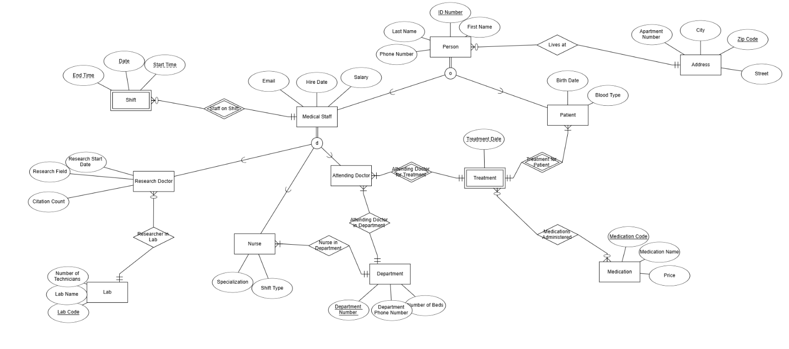

---

### DSD (Data Structure Diagram)

The **DSD** provides a detailed view of table structures and relationships.

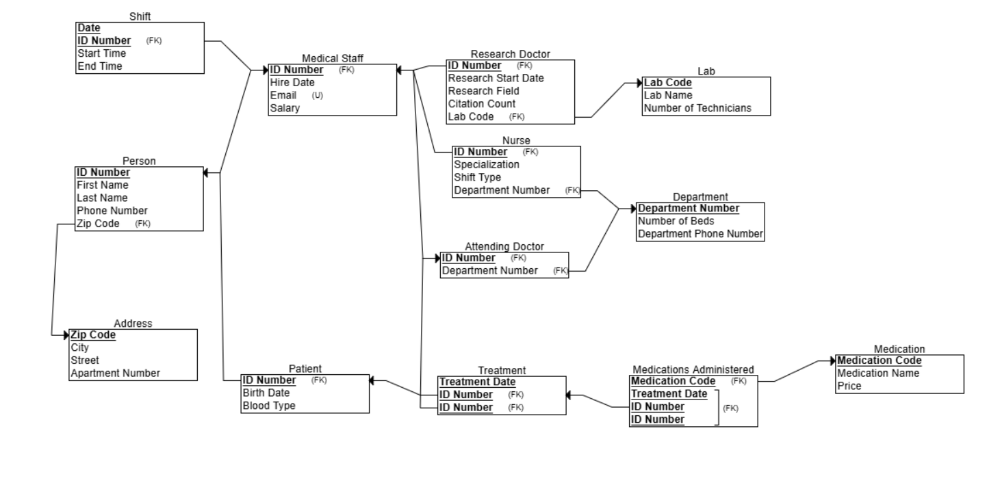

---

### SQL Scripts

The following SQL scripts are included in the repository:

- **Create Tables**: Defines the database schema.  
  📜 View [`create_tables.sql`](Phase1/Scripts/createTables.sql)
- **Insert Data**: Populates the tables with sample data.  
  📜 View [`insert_data.sql`](Phase1/Scripts/insertTables.sql)
- **Drop Tables**: Removes all tables from the database.  
  📜 View [`drop_tables.sql`](Phase1/Scripts/dropTables.sql)
- **Select All Data**: Retrieves all data from the tables.  
  📜 View [`select_all.sql`](Phase1/Scripts/selectAll.sql)

---

### Data Insertion

To generate and insert realistic data, three different methods were used:

#### 1. Mock Data Generation (Mockaroo)

- Used to generate random CSV files for data insertion.
- Example:
    - 📜 View [`mock_data`](Phase1/mockarooFiles)
    - 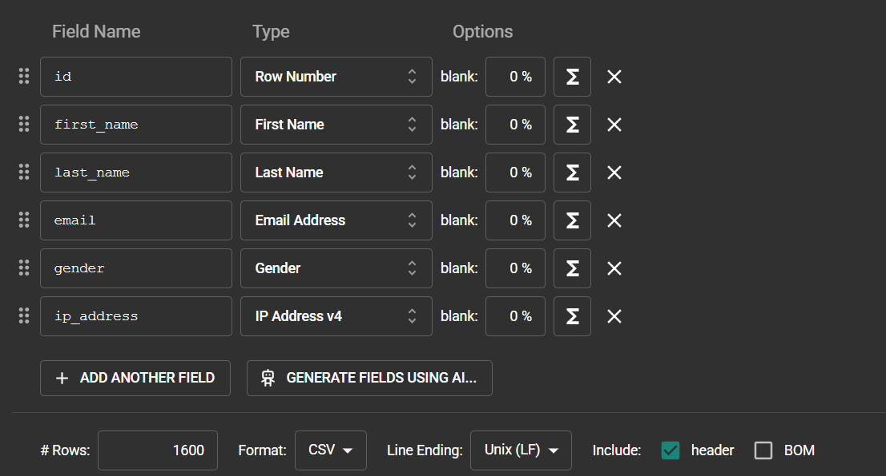

#### 2. Generated Data Tool

- Created structured test data.
- Example:
    - 📜 View [`generated_data.csv`](Phase1/generatedataFiles)
    - 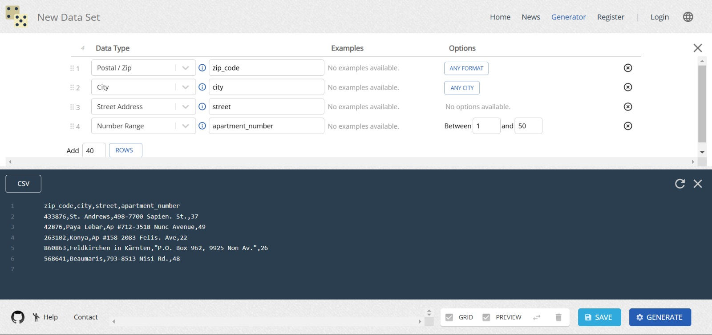

#### 3. Python Script for Data Generation

- Automated data generation with Python scripts.
- Example:
    - 📜 View [`from_csv_to_sql.py`](Phase1/Programming/from_csv_to_sql.py)
    - 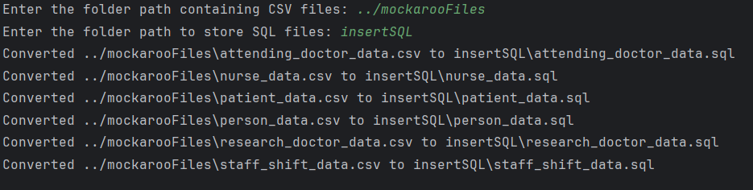

---

### Backup and Restore

Database backups are stored with timestamps to ensure data safety and recovery when needed.

📂 [Go to Backup Directory](Backup)

#### Backup Process

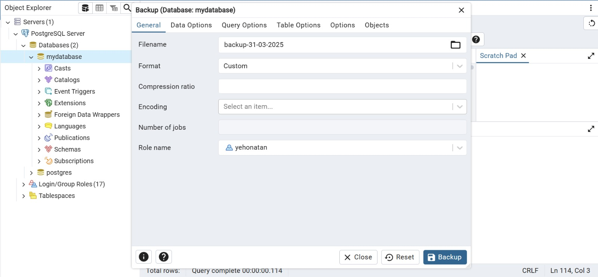

#### Restore Process

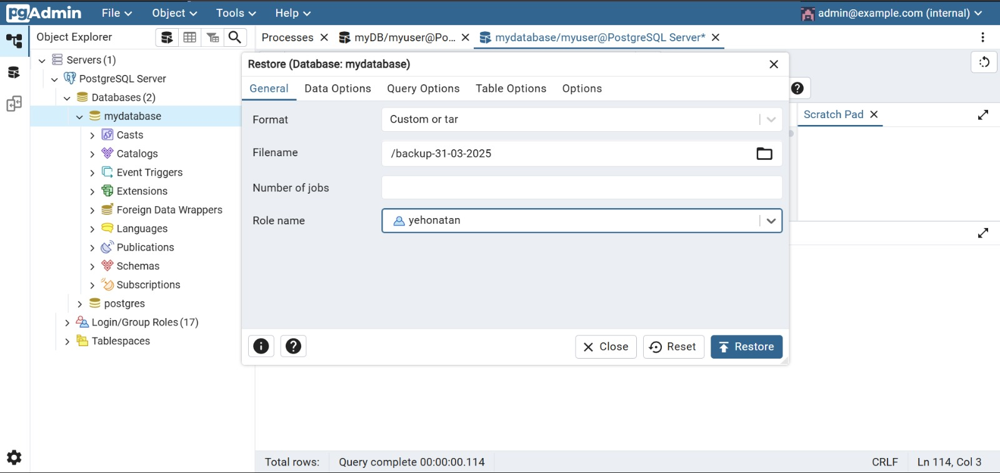

---

## Phase 2 - Queries

### Select Queries

📁 [The Select Queries File](Phase2/selectQueries.sql)

### הסבר השאילתות:

1. **הצגת נתוני משמרות של רופאים**: מציגה את תאריך המשמרת, שעת התחלה וסיום, מזהה הרופא, שמו המלא, וכמות המטופלים שטופלו
   באותה משמרת.
   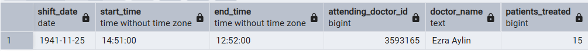


2. **סוג הדם הנפוץ ביותר בכל מחלקה**: מציגה לכל מחלקה את סוג הדם הכי נפוץ של מטופלים שטופלו בה ואת מספר הפעמים שהוא
   הופיע.
   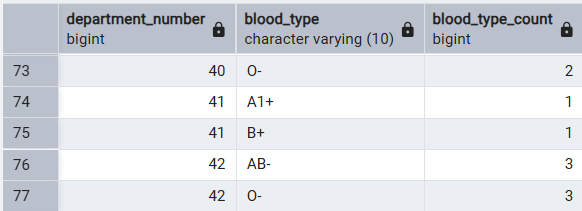


3. **סוג הדם שטופל הכי הרבה פעמים**: מציגה את סוג הדם של מטופלים שקיבלו הכי הרבה טיפולים.
    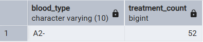


4. **החוקרים המצטיינים מבין הרופאים החדשים**: מציגה את שלושת הרופאי מחקר שקיבלו הכי הרבה ציטוטים, מבין אלו שהצטרפו ב-5 השנים
   האחרונות.
    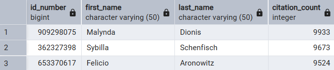


5. **התרופות השכיחות בכל מחלקה**: מציגה עבור כל מחלקה את שם התרופה ואת מספר הפעמים שהיא ניתנה לפי טיפולים שבוצעו בה.
    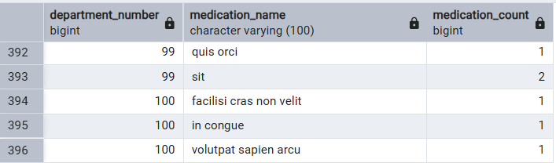


6. **רופאים שטיפלו ביותר מ-10 מטופלים ביום מסוים**: מזהה רופאים שביצעו יותר מ-10 טיפולים ביום נתון.
    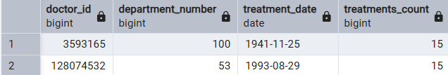


7. **מטופלים עם הכי הרבה טיפולים**: מציגה את המטופלים שקיבלו את מספר הטיפולים הגבוה ביותר.
    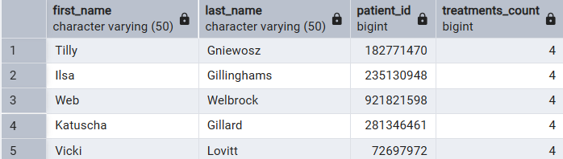


8.  **המחלקה עם הכי הרבה מטופלים ב-6 החודשים האחרונים**: מציגה איזו מחלקה טיפלה בהכי הרבה מטופלים שונים במהלך חצי השנה האחרונה.
    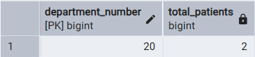


### Delete Queries
📁 [The Delete Queries File](Phase2/deleteQueries.sql)
### הסבר השאילתות:
1. **מחיקת מטופלים שלא קיבלו טיפול ב15 שנה האחרונות**: מסננת את המטופלים שלא קיבלו טיפול ב-15 השנים האחרונות ומוחקת אותם מהמאגר.
    ###### Before Delete
    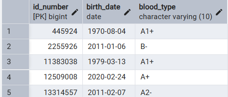
    ###### After Delete
    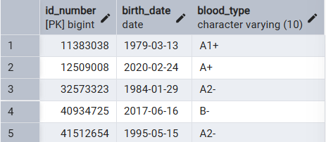
    ###### נמחקו 256 מטופלים בשאילתה זו 

2. **מחיקת מחלקות שאין בהן רופאים או מטופלים**: מסננת את המחלקות שאין בהן רופאים ומוחקת אותן מהמאגר.
    ###### Before Delete
    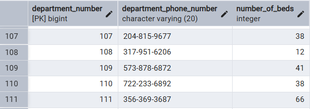
    ###### After Delete
    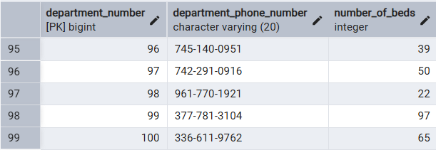
    ###### נמחקו 301 מחלקות בשאילתה זו

3. **מחיקת תרופות שלא היו בשימוש אצל מעל 7% מהמטופלים**: מסננת את התרופות שלא היו בשימוש אצל מעל 7% מהמטופלים ומוחקת אותן מהמאגר.
    ###### Before Delete
    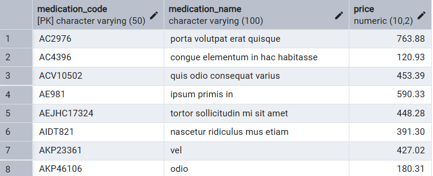
    ###### After Delete
    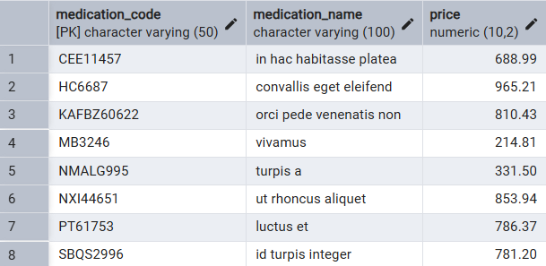
    ###### נמחקו 390 תרופות בשאילתה זו


#### Update Queries
📁 [The Update Queries File](Phase2/updateQueries.sql)

### הסבר השאילתות:


1. עדכנו את השכר של החוקרים עם מעל 300 ציטוטים ב5%.
    ###### Before Update
    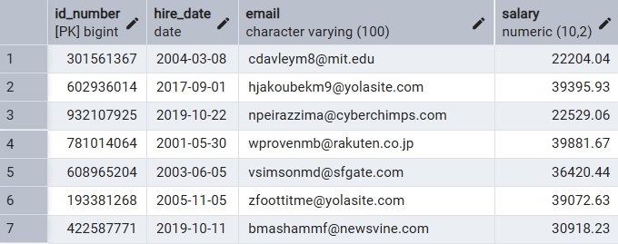
    ###### After Update
    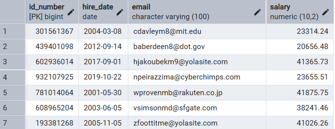

---

2. עדכנו את מחיר התרופות של תרופות שהיו בשימוש במעל 20 טיפולים שונים ב5%.
    ###### Before Update
    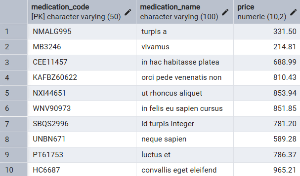
    ###### After Update
    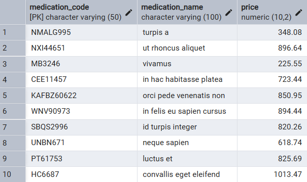

---

3. עדכנו את מספר המיטות במחלקות שיש בהן פחות מחצי מיטות מאשר אחיות במשמרת לילה להיות בעוד 50% מיטות.
    ###### Before Update
    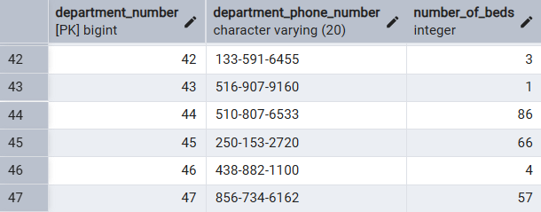
    ###### After Update
    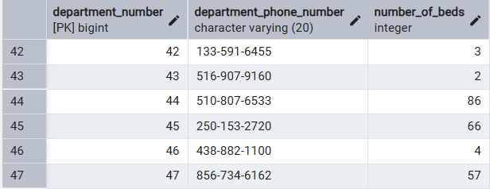


---


### Constraints
📁 [The Constraint File](Phase2/constraints.sql)

בשלב הזה הוספנו **אילוצים** ל-12 טבלאות במסד הנתונים כדי להבטיח את תקינות הנתונים ולמנוע טעויות כמו ערכים שגויים או כפולים.

לכל אילוץ צורף ניסיון להכניס נתון שמפר את האילוץ, ונצפתה שגיאה מתאימה.  
מצורפות תמונות **לפני** ו-**אחרי** לכל ניסיון כזה.

---

## List of Constraints for Each Table

### Address Table
```sql
ALTER TABLE address
ADD CONSTRAINT chk_zip_code_format CHECK (zip_code ~ '^[0-9]{5}$');
```
מוודא שקוד הדואר מכיל בדיוק 5 ספרות. 

 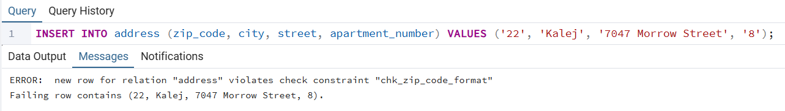 

---

### Lab Table
```sql
ALTER TABLE lab
ADD CONSTRAINT chk_lab_num_technicians CHECK (number_of_technicians >= 1);
```
 חייב להיות לפחות טכנאי אחד במעבדה.

 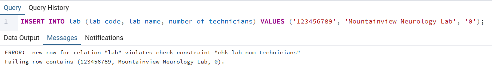

---

### Department Table
```sql
ALTER TABLE department
ADD CONSTRAINT chk_department_beds CHECK (number_of_beds >= 0);
```
 מספר מיטות לא יכול להיות שלילי.

 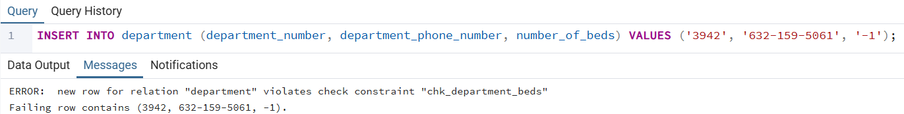


```sql
ALTER TABLE department
ADD CONSTRAINT chk_department_phone_length CHECK (LENGTH(department_phone_number) >= 7);
```

 מספר טלפון חייב להיות לפחות באורך 7 ספרות.

 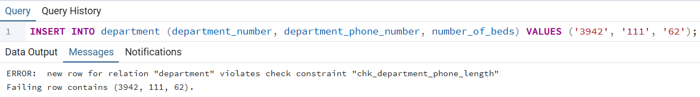

---

### Medication Table
```sql
ALTER TABLE medication
ADD CONSTRAINT chk_medication_price_positive CHECK (price > 0);
```
מחיר חייב להיות חיובי. 
    
  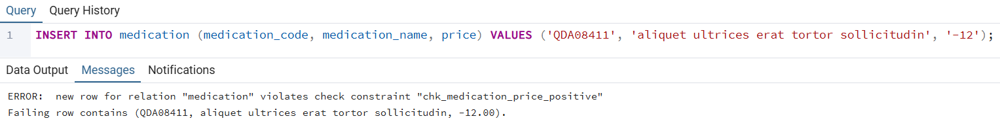
```sql
ALTER TABLE medication
ADD CONSTRAINT chk_medication_name_length CHECK (LENGTH(medication_name) >= 2);
```
 שם התרופה חייב לכלול לפחות שני תווים.

 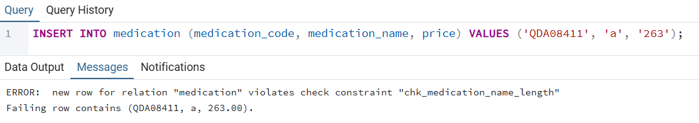

---

### Person Table
```sql
ALTER TABLE person
ADD CONSTRAINT chk_id_number_range CHECK (id_number > 0 AND id_number < 9999999999);
```
 ת"ז בתחום הגיוני – בין 1 ל-9999999999.
 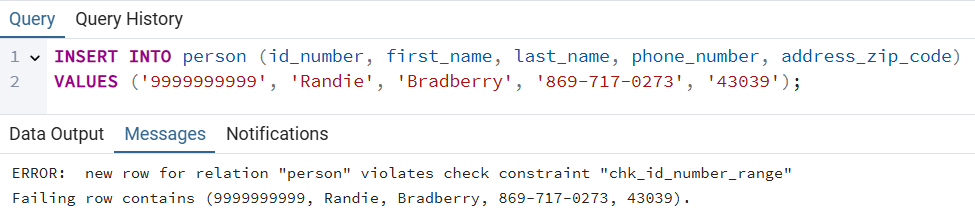

---

### Patient Table
```sql
ALTER TABLE patient
ADD CONSTRAINT chk_birth_date_not_future CHECK (birth_date <= CURRENT_DATE);
```
תאריך לידה לא יכול להיות בעתיד. 
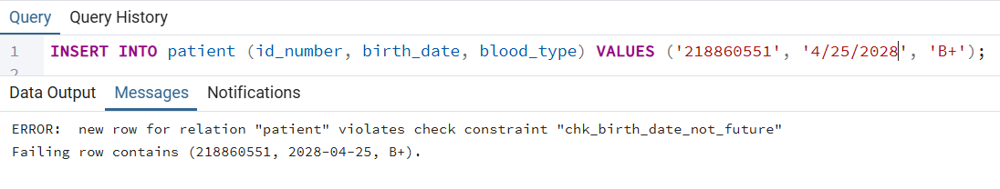
```sql
ALTER TABLE patient
ADD CONSTRAINT chk_valid_blood_type CHECK (blood_type IN (
  'A+', 'A-', 'B+', 'B-', 'O+', 'O-', 'AB+', 'AB-', 'A2-', 'A1+'));
```
 סוג דם חייב להיות אחד מהאפשרויות התקינות.
 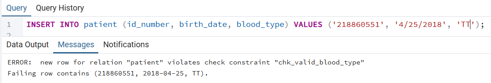

---

### Medical Staff Table
```sql
ALTER TABLE medical_staff
ADD CONSTRAINT chk_hire_date_not_future CHECK (hire_date <= CURRENT_DATE);
```
תאריך התחלה לא יכול להיות בעתיד. 
 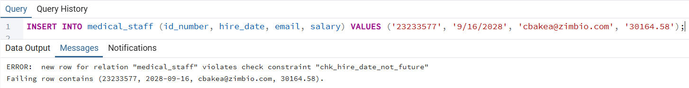

```sql
ALTER TABLE medical_staff
ADD CONSTRAINT chk_salary_minimum CHECK (salary >= 5000);
```
שכר מינימלי – 5000. 
 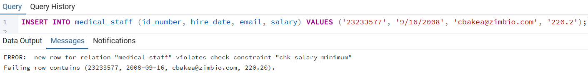

```sql
ALTER TABLE medical_staff
ADD CONSTRAINT chk_email_format CHECK (email ~* '^[A-Za-z0-9._%+-]+@[A-Za-z0-9.-]+\\.[A-Za-z]{2,}$');
```
 אימייל חייב להיות בפורמט תקני.
 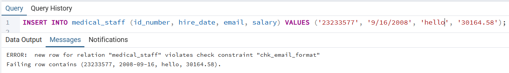

---

### Nurse Table
```sql
ALTER TABLE nurse
ADD CONSTRAINT chk_valid_shift_type CHECK (shift_type IN ('day', 'night'));
```
 ערך חוקי למשמרת: רק "day" או "night".
 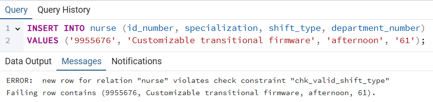
---

### Research Doctor Table
```sql
ALTER TABLE research_doctor
ADD CONSTRAINT chk_citation_count_non_negative CHECK (citation_count >= 0);
```
 מספר ציטוטים לא שלילי.
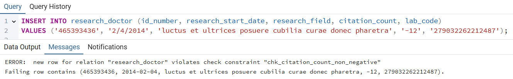

---

### Treatment medication Table
```sql
ALTER TABLE treatment_medication
ADD CONSTRAINT chk_medication_code_format CHECK (medication_code ~ '^[A-Za-z0-9\-]+$');  -- Example format: alphanumeric with dashes
```
קוד תרופה חייב להיות בפורמט חוקי (אלפאנומרי עם מקפים).
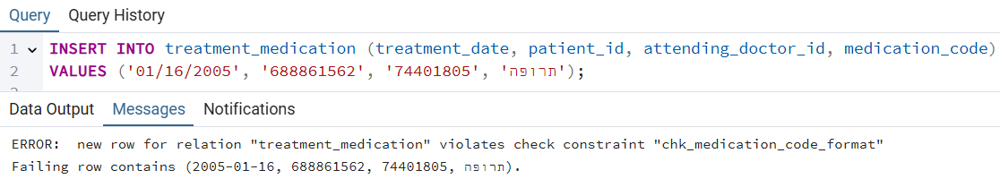

---

### Backup and Restore

Database backups are stored with timestamps to ensure data safety and recovery when needed.

📂 [Go to Backup Directory](Backup)

#### Backup Process

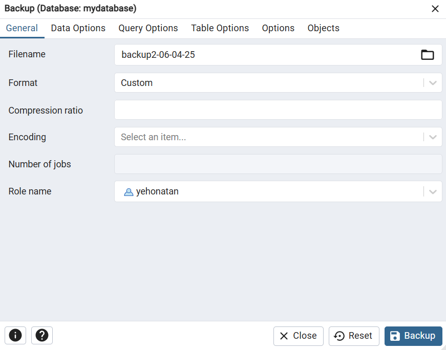

#### Restore Process


---


