# Database Project

###### *By Yehonatan Yeret && Maor Noy*

## Table of Contents

- [Phase 1 - Database Design & Implementation](#phase-1---database-design--implementation)
    - [Introduction](#introduction)
    - [ERD (Entity-Relationship Diagram)](#erd-entity-relationship-diagram)
    - [DSD (Data Structure Diagram)](#dsd-data-structure-diagram)
    - [SQL Scripts](#sql-scripts)
    - [Data Insertion](#data-insertion)
    - [Backup and Restore](#backup-and-restore-1)
- [Phase 2 - Queries](#phase-2---queries)
    - [Select Queries](#select-queries)
    - [Delete Queries](#delete-queries)
    - [Update Queries](#update-queries)
    - [Rollback And Commit](#rollback-and-commit)
    - [Constraint Queries](#constraints)
    - [Backup and Restore](#backup-and-restore-2)
- [Phase 3 - integrate with other Databases](#phase-3---integrate-with-other-databases)
    - [Integration](#integrations)
    - [Integration Diagrams](#integration-diagrams)
    - [Integration Process and Commands](#integration-process-and-commands)
    - [Integration Strategy](#integration-strategy)
    - [Integration Highlights](#integration-highlights)
    - [Database Views](#database-views)
        - [View 1: Logistic_Worker_Access](#view-1-logistic_worker_access)
        - [View 2: Treatments_By_Doctor](#view-2-treatments_by_doctor)
    - [Backup and Restore](#backup-and-restore-3)
- [Phase 4 - Programming](#phase-4---programming)
    - [first program](#first-program)
    - [second program](#second-program)
    - [Backup and Restore](#backup-and-restore-4)
- [Phase 5 - Hospital Management Application](#Phase-5---Hospital-Management-Application)
    - [Running Instructions](#running-instructions)
    - [Tools & Technologies Used](#tools--technologies-used)
    - [File & Folder Structure](#file--folder-structure)
    - [Internal Documentation](#internal-documentation)
    - [Screenshots (replace with actual screenshots)](#screenshots-replace-with-actual-screenshots)

---

## Phase 1 - Database Design & Implementation

### Introduction

#### Project Overview

This project is part of a **Database Fundamentals Course** and focuses on designing, implementing, and managing a
structured database. The system is designed to store and process essential data efficiently while ensuring reliability
and accessibility.

#### Purpose of the Database

The primary goals of this project are:

- **Database Design**: Creating a well-structured relational database.
- **Efficient Data Storage**: Organizing data to allow quick retrieval and manipulation.
- **Data Integrity and Consistency**: Implementing constraints to maintain valid data.
- **Backup and Recovery**: Ensuring that data is not lost and can be restored when needed.

#### Key Functionalities

- **Data storage and retrieval** using SQL queries.
- **Relationships between tables** ensuring logical connections.
- **Simulating real-world scenarios** where database management is crucial.
- **Automation of data entry** using external tools.

---

### ERD (Entity-Relationship Diagram)

The **ERD** illustrates the logical structure of the database, showing entities, attributes, and relationships.


---

### DSD (Data Structure Diagram)

The **DSD** provides a detailed view of table structures and relationships.


---

### SQL Scripts

The following SQL scripts are included in the repository:

- **Create Tables**: Defines the database schema.  
  📜 View [`create_tables.sql`](Phase1/Scripts/createTables.sql)
- **Insert Data**: Populates the tables with sample data.  
  📜 View [`insert_data.sql`](Phase1/Scripts/insertTables.sql)
- **Drop Tables**: Removes all tables from the database.  
  📜 View [`drop_tables.sql`](Phase1/Scripts/dropTables.sql)
- **Select All Data**: Retrieves all data from the tables.  
  📜 View [`select_all.sql`](Phase1/Scripts/selectAll.sql)

---

### Data Insertion

To generate and insert realistic data, three different methods were used:

#### 1. Mock Data Generation (Mockaroo)

- Used to generate random CSV files for data insertion.
- Example:
    - 📜 View [`mock_data`](Phase1/mockarooFiles)
    - 

#### 2. Generated Data Tool

- Created structured test data.
- Example:
    - 📜 View [`generated_data.csv`](Phase1/generatedataFiles)
    - 

#### 3. Python Script for Data Generation

- Automated data generation with Python scripts.
- Example:
    - 📜 View [`from_csv_to_sql.py`](Phase1/Programming/from_csv_to_sql.py)
    - 

---

### Backup and Restore 1

Database backups are stored with timestamps to ensure data safety and recovery when needed.

📂 [Go to Backup Directory](Backup)

#### Backup Process


#### Restore Process


---

## Phase 2 - Queries

### Select Queries

📁 [The Select Queries File](Phase2/selectQueries.sql)

### הסבר השאילתות:

1. **הצגת נתוני משמרות של רופאים**: מציגה את תאריך המשמרת, שעת התחלה וסיום, מזהה הרופא, שמו המלא, וכמות המטופלים שטופלו
   באותה משמרת.
   


2. **סוג הדם הנפוץ ביותר בכל מחלקה**: מציגה לכל מחלקה את סוג הדם הכי נפוץ של מטופלים שטופלו בה ואת מספר הפעמים שהוא
   הופיע.
   


3. **סוג הדם שטופל הכי הרבה פעמים**: מציגה את סוג הדם של מטופלים שקיבלו הכי הרבה טיפולים.
    


4. **החוקרים המצטיינים מבין הרופאים החדשים**: מציגה את שלושת הרופאי מחקר שקיבלו הכי הרבה ציטוטים, מבין אלו שהצטרפו ב-5 השנים
   האחרונות.
    


5. **התרופות השכיחות בכל מחלקה**: מציגה עבור כל מחלקה את שם התרופה ואת מספר הפעמים שהיא ניתנה לפי טיפולים שבוצעו בה.
    


6. **רופאים שטיפלו ביותר מ-10 מטופלים ביום מסוים**: מזהה רופאים שביצעו יותר מ-10 טיפולים ביום נתון.
    


7. **מטופלים עם הכי הרבה טיפולים**: מציגה את המטופלים שקיבלו את מספר הטיפולים הגבוה ביותר.
    


8.  **המחלקה עם הכי הרבה מטופלים ב-6 החודשים האחרונים**: מציגה איזו מחלקה טיפלה בהכי הרבה מטופלים שונים במהלך חצי השנה האחרונה.
    


### Delete Queries
📁 [The Delete Queries File](Phase2/deleteQueries.sql)
### הסבר השאילתות:
1. **מחיקת מטופלים שלא קיבלו טיפול ב15 שנה האחרונות**: מסננת את המטופלים שלא קיבלו טיפול ב-15 השנים האחרונות ומוחקת אותם מהמאגר.
    ###### Before Delete
    
    ###### After Delete
    
    ###### נמחקו 256 מטופלים בשאילתה זו 

2. **מחיקת מחלקות שאין בהן רופאים או מטופלים**: מסננת את המחלקות שאין בהן רופאים ומוחקת אותן מהמאגר.
    ###### Before Delete
    
    ###### After Delete
    
    ###### נמחקו 301 מחלקות בשאילתה זו

3. **מחיקת תרופות שלא היו בשימוש אצל מעל 7% מהמטופלים**: מסננת את התרופות שלא היו בשימוש אצל מעל 7% מהמטופלים ומוחקת אותן מהמאגר.
    ###### Before Delete
    
    ###### After Delete
    
    ###### נמחקו 390 תרופות בשאילתה זו


#### Update Queries
📁 [The Update Queries File](Phase2/updateQueries.sql)

### הסבר השאילתות:


1. עדכנו את השכר של החוקרים עם מעל 300 ציטוטים ב5%.
    ###### Before Update
    
    ###### After Update
    

---

2. עדכנו את מחיר התרופות של תרופות שהיו בשימוש במעל 20 טיפולים שונים ב5%.
    ###### Before Update
    
    ###### After Update
    

---

3. עדכנו את מספר המיטות במחלקות שיש בהן פחות מחצי מיטות מאשר אחיות במשמרת לילה להיות בעוד 50% מיטות.
    ###### Before Update
    
    ###### After Update
    


---


### Rollback And Commit
📁 [The Rollback and Commit File](Phase2/rollbackCommit.sql)

### הסבר השאילתות:
1. הוספת אדם חדש למערכת ואחר כך ביצוע חזרה לאחור

    ### בעזרת הפקודה הבאה נבדוק את השינוי בבסיס הנתונים לאחר כל פקודה:
    ```sql
    SELECT *
    FROM person
    WHERE id_number = 1111111;
    ``` 
    
    ###### Before Commit
    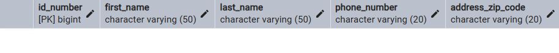
    ###### After Commit and Insert
    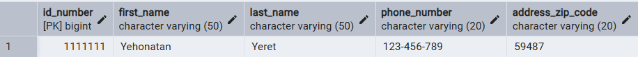
    ###### After Rollback
    

2. הוספת אדם חדש למערכת ואחר כך שמירת השינויים במערכת

    ### בעזרת הפקודה הבאה נבדוק את השינוי בבסיס הנתונים לאחר כל פקודה:
    ```sql
    SELECT *
    FROM person
    WHERE id_number = 2222222;
    ``` 
    
    ###### Before Commit
    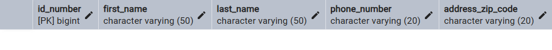
    ###### After Commit and Insert
    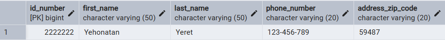
    ###### After Second Commit (to save changes)
    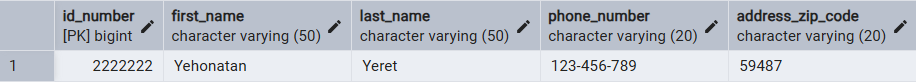


### Constraints
📁 [The Constraint File](Phase2/constraints.sql)

בשלב הזה הוספנו **אילוצים** ל-12 טבלאות במסד הנתונים כדי להבטיח את תקינות הנתונים ולמנוע טעויות כמו ערכים שגויים או כפולים.

לכל אילוץ צורף ניסיון להכניס נתון שמפר את האילוץ, ונצפתה שגיאה מתאימה.  
מצורפות תמונות **לפני** ו-**אחרי** לכל ניסיון כזה.

---

## List of Constraints for Each Table

### Address Table
```sql
ALTER TABLE address
ADD CONSTRAINT chk_zip_code_format CHECK (zip_code ~ '^[0-9]{5}$');
```
מוודא שקוד הדואר מכיל בדיוק 5 ספרות. 

  

---

### Lab Table
```sql
ALTER TABLE lab
ADD CONSTRAINT chk_lab_num_technicians CHECK (number_of_technicians >= 1);
```
 חייב להיות לפחות טכנאי אחד במעבדה.

 

---

### Department Table
```sql
ALTER TABLE department
ADD CONSTRAINT chk_department_beds CHECK (number_of_beds >= 0);
```
 מספר מיטות לא יכול להיות שלילי.

 


```sql
ALTER TABLE department
ADD CONSTRAINT chk_department_phone_length CHECK (LENGTH(department_phone_number) >= 7);
```

 מספר טלפון חייב להיות לפחות באורך 7 ספרות.

 

---

### Medication Table
```sql
ALTER TABLE medication
ADD CONSTRAINT chk_medication_price_positive CHECK (price > 0);
```
מחיר חייב להיות חיובי. 
    
  
```sql
ALTER TABLE medication
ADD CONSTRAINT chk_medication_name_length CHECK (LENGTH(medication_name) >= 2);
```
 שם התרופה חייב לכלול לפחות שני תווים.

 

---

### Person Table
```sql
ALTER TABLE person
ADD CONSTRAINT chk_id_number_range CHECK (id_number > 0 AND id_number < 9999999999);
```
 ת"ז בתחום הגיוני – בין 1 ל-9999999999.
 

---

### Patient Table
```sql
ALTER TABLE patient
ADD CONSTRAINT chk_birth_date_not_future CHECK (birth_date <= CURRENT_DATE);
```
תאריך לידה לא יכול להיות בעתיד. 

```sql
ALTER TABLE patient
ADD CONSTRAINT chk_valid_blood_type CHECK (blood_type IN (
  'A+', 'A-', 'B+', 'B-', 'O+', 'O-', 'AB+', 'AB-', 'A2-', 'A1+'));
```
 סוג דם חייב להיות אחד מהאפשרויות התקינות.
 

---

### Medical Staff Table
```sql
ALTER TABLE medical_staff
ADD CONSTRAINT chk_hire_date_not_future CHECK (hire_date <= CURRENT_DATE);
```
תאריך התחלה לא יכול להיות בעתיד. 
 

```sql
ALTER TABLE medical_staff
ADD CONSTRAINT chk_salary_minimum CHECK (salary >= 5000);
```
שכר מינימלי – 5000. 
 

```sql
ALTER TABLE medical_staff
ADD CONSTRAINT chk_email_format CHECK (email ~* '^[A-Za-z0-9._%+-]+@[A-Za-z0-9.-]+\\.[A-Za-z]{2,}$');
```
 אימייל חייב להיות בפורמט תקני.
 

---

### Nurse Table
```sql
ALTER TABLE nurse
ADD CONSTRAINT chk_valid_shift_type CHECK (shift_type IN ('day', 'night'));
```
 ערך חוקי למשמרת: רק "day" או "night".
 
---

### Research Doctor Table
```sql
ALTER TABLE research_doctor
ADD CONSTRAINT chk_citation_count_non_negative CHECK (citation_count >= 0);
```
 מספר ציטוטים לא שלילי.


---

### Treatment medication Table
```sql
ALTER TABLE treatment_medication
ADD CONSTRAINT chk_medication_code_format CHECK (medication_code ~ '^[A-Za-z0-9\-]+$');  -- Example format: alphanumeric with dashes
```
קוד תרופה חייב להיות בפורמט חוקי (אלפאנומרי עם מקפים).


---

### Backup and Restore 2

Database backups are stored with timestamps to ensure data safety and recovery when needed.

📂 [Go to Backup Directory](Backup)

#### Backup Process


#### Restore Process

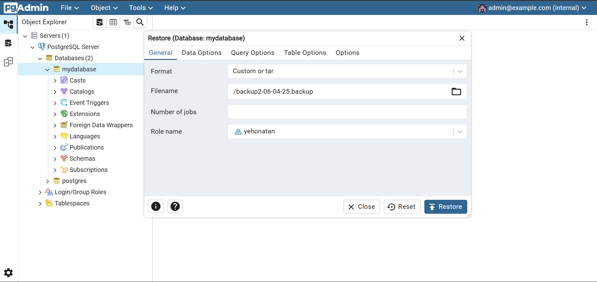

---

## Phase 3 - integrate with other Databases
### Integrations
📁 [The Integration File](Phase3/Integrate.sql)

#### Integration Diagrams
The integration process involved merging our database with an external database ("Medicines") to enhance functionality and data management. The following diagrams illustrate the merged structure:
before integration we made reverse engineering for the external database and created a new ERD and DSD for it.
### Medicines ERD 
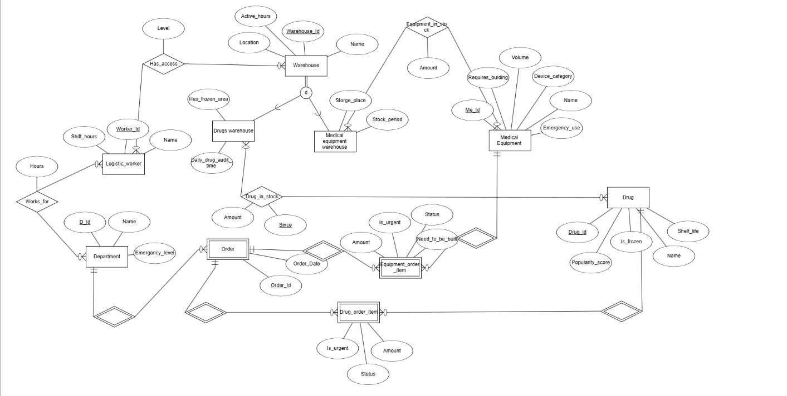

### Medicines DSD
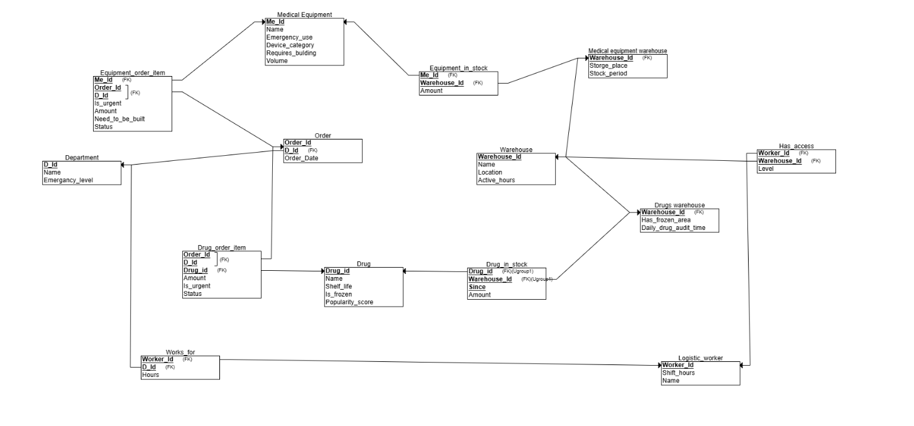

Then we merged the two databases into one, creating a new ERD and DSD that reflects the combined structure.

### Merged ERD
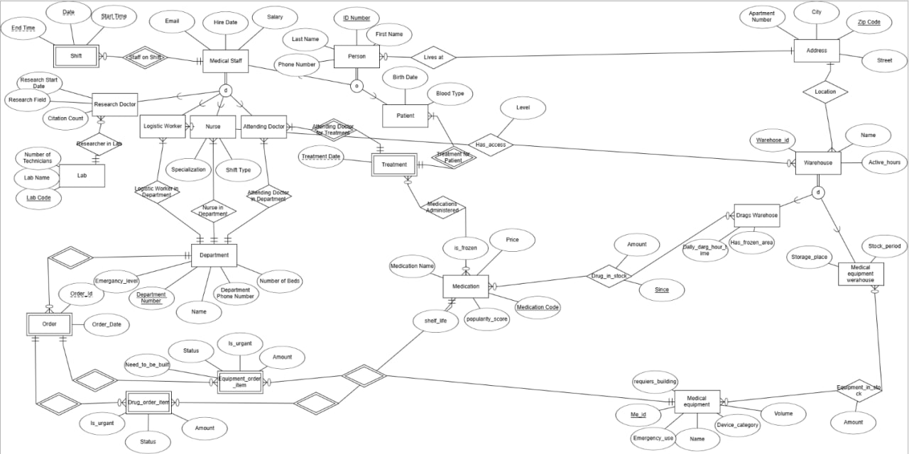

### Merged DSD
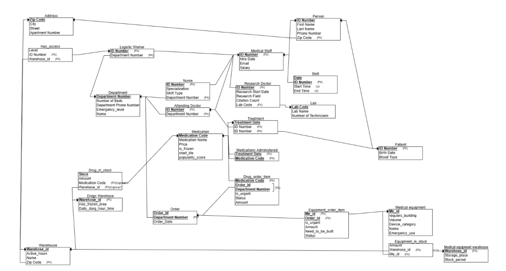

#### Integration Process and Commands

To integrate the external database ("Medicines") with our database, we performed the following steps:

1. **Creating a Remote Connection with postgres_fdw**:
   ```sql
   CREATE EXTENSION IF NOT EXISTS postgres_fdw;
   CREATE SERVER other_db FOREIGN DATA WRAPPER postgres_fdw 
     OPTIONS (host 'localhost', port '5432', dbname 'Medicines');
   CREATE USER MAPPING FOR current_user SERVER other_db 
     OPTIONS (user 'yehonatan', password '12345678');
   IMPORT FOREIGN SCHEMA public FROM SERVER other_db INTO foreign_schema;
   ```
   These commands allow direct access to external data without unnecessary duplication.

2. **Extending Existing Tables**:
   ```sql
   ALTER TABLE Department ADD COLUMN Name VARCHAR(100);
   ALTER TABLE Medication ADD COLUMN Shelf_life INT;
   ```
   We added new columns to existing tables to enrich the data and enable advanced analysis.

3. **Creating Integrated Tables**:
   ```sql
   CREATE TABLE Orders (
     order_id SERIAL PRIMARY KEY,
     Department_number INT REFERENCES Department(department_number),
     order_date DATE
   );
   
   CREATE TABLE Drug_order_item (
     item_id SERIAL PRIMARY KEY,
     order_id INT REFERENCES Orders(order_id) ON DELETE CASCADE,
     medication_id INT REFERENCES Medication(medication_id),
     quantity INT
   );
   ```
   We created linking tables that combine data from different sources.

4. **Combining Data Between Sources**:
   ```sql
   INSERT INTO Orders (order_id, Department_number, order_date)
   SELECT o.order_id, d.department_number, o.order_date
   FROM foreign_schema."Order" o
   JOIN Department d ON ...;
   ```
   We transferred data between sources while adjusting the keys and logical relationships.

#### Integration Strategy

Our integration approach focused on connecting our medical database with an external medicine management system ("Medicines" database) to create a complete healthcare management solution:

1. **Foreign Data Connection:**
   - Used `postgres_fdw` to seamlessly connect to the external database
   - Imported external schema into a dedicated `foreign_schema` to prevent name collisions

2. **Database Enhancements:**
   - Added new columns to existing tables (Department, Medication) for better data management
   - Created relationships between local and external tables with proper foreign key constraints

3. **Data Integration Techniques:**
   - Used `ROW_NUMBER()` for matching records lacking direct keys
   - Applied normalization principles for medical supplies and equipment
   - Maintained referential integrity with `ON DELETE CASCADE` settings

4. **New Functional Areas:**
   - Warehouse management for medical supplies and equipment
   - Order processing system for medications and equipment
   - Inventory tracking with proper stock management
   - Staff access control for logistics operations

#### Integration Highlights

The integration creates a complete medical facility management system where:

- Medical departments can track and order supplies directly
- Inventory levels are maintained and monitored across warehouses
- Staff permissions ensure proper access control to sensitive areas
- Supply chains and logistics are integrated with patient care systems


#### Database Views
The integration process also involved creating views to simplify data access and reporting. The following views were created:
📁 [Views for Integrated Data](Phase3/Views.sql)

##### View 1: Logistic_Worker_Access
**Description**: Displays access permissions of logistics workers to different warehouses, showing worker details, warehouse information, and access level.

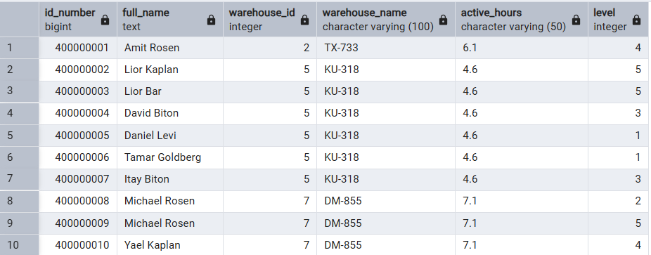

**View Creation:**
```sql
CREATE VIEW Logistic_Worker_Access AS
SELECT
    p.ID_number,
    CONCAT(p.First_name, ' ', p.Last_name) AS Full_Name,
    w.Warehouse_Id,
    w.Name AS Warehouse_Name,
    w.Active_hours,
    ha.Level
FROM
    Person p
    JOIN Logistic_worker lw ON p.ID_number = lw.ID_number
    JOIN Has_access ha ON lw.ID_number = ha.ID_number
    JOIN Warehouse w ON ha.Warehouse_Id = w.Warehouse_Id;
```

**Query 1: Workers with Full Access (Level 5)**
```sql
SELECT *
FROM Logistic_Worker_Access
WHERE Level = 5;
```
**Query Description**: Identifies all logistics workers with highest level permissions (level 5), which grants full access to warehouse operations.

**Output**: Returns personal details of workers with full access privileges, including their ID, name, assigned warehouse, and operating hours.

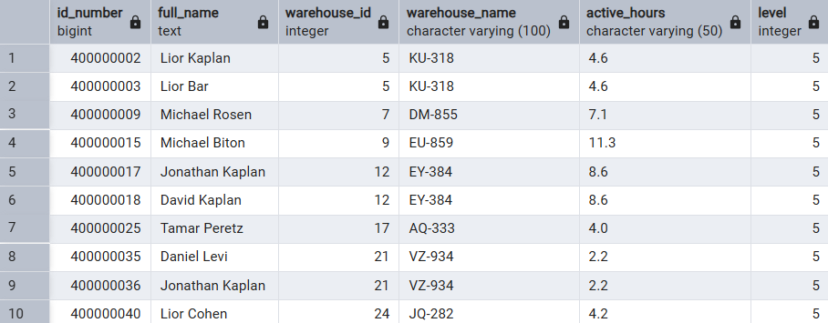

**Query 2: Worker Count by Warehouse**
```sql
SELECT
    Warehouse_Name,
    COUNT(DISTINCT ID_number) AS Num_Workers
FROM Logistic_Worker_Access
GROUP BY Warehouse_Name;
```
**Query Description**: Provides a count of staff assigned to each warehouse, helping identify staffing levels across different storage facilities.

**Output**: Lists each warehouse name along with the total number of unique workers who have access to it.

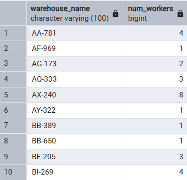

##### View 2: Treatments_By_Doctor
**Description**: Shows treatment details connecting patients with their attending doctors, including dates and personal information.

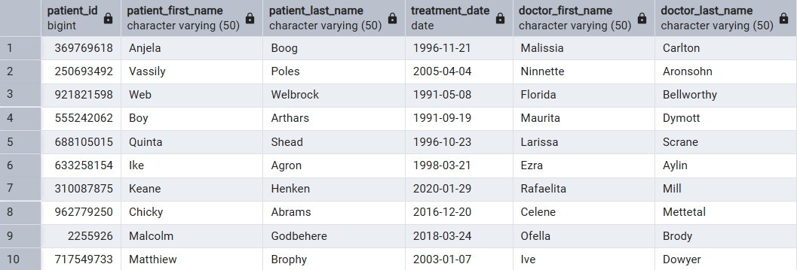

**View Creation:**
```sql
CREATE VIEW Treatments_By_Doctor AS
SELECT
    p_patient.ID_number AS Patient_ID,
    p_patient.First_Name AS Patient_First_Name,
    p_patient.Last_Name AS Patient_Last_Name,
    t.Treatment_Date,
    p_doctor.First_Name AS Doctor_First_Name,
    p_doctor.Last_Name AS Doctor_Last_Name
FROM
    Treatment t
JOIN Patient pat ON t.Patient_ID = pat.ID_number
JOIN Person p_patient ON pat.ID_number = p_patient.ID_number
JOIN Attending_doctor ad ON t.attending_doctor_id = ad.ID_number
JOIN Person p_doctor ON ad.ID_number = p_doctor.ID_number;
```

**Query 1: Treatment Count by Doctor**
```sql
SELECT Doctor_First_Name, Doctor_Last_Name, COUNT(*) AS Treatment_Count
FROM Treatments_By_Doctor
GROUP BY Doctor_First_Name, Doctor_Last_Name
ORDER BY Treatment_Count DESC;
```
**Query Description**: Analyzes doctor workload by counting the total number of treatments performed by each physician.

**Output**: Returns a list of doctors sorted by highest treatment count, useful for evaluating workload distribution and productivity.

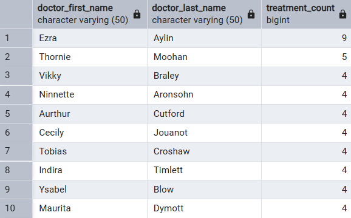

**Query 2: Doctors with Multiple Unique Patients**
```sql
SELECT Doctor_First_Name, Doctor_Last_Name, COUNT(DISTINCT Patient_ID) AS Unique_Patients
FROM Treatments_By_Doctor
GROUP BY Doctor_First_Name, Doctor_Last_Name
HAVING COUNT(DISTINCT Patient_ID) > 3;
```
**Query Description**: Identifies doctors who have treated more than three unique patients, indicating physicians with broader case variety.

**Output**: Shows each qualifying doctor's name along with their count of unique patients, useful for analyzing patient distribution.

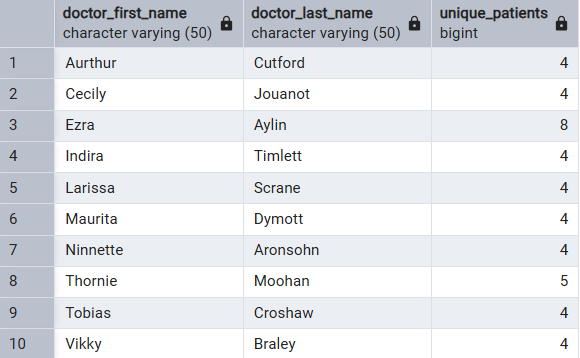

### Backup and Restore 3

Database backups include the integrated data structure to ensure complete recovery when needed.
📂 [Go to Backup Directory](Backup)

#### Backup Process

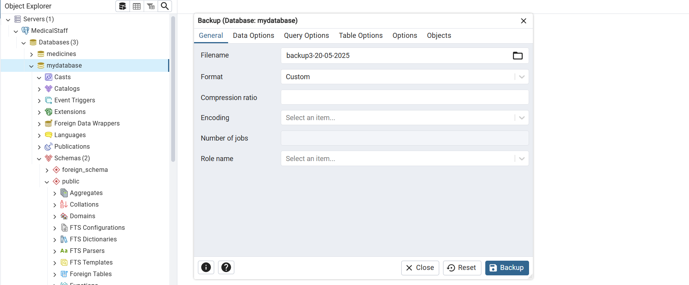

#### Restore Process

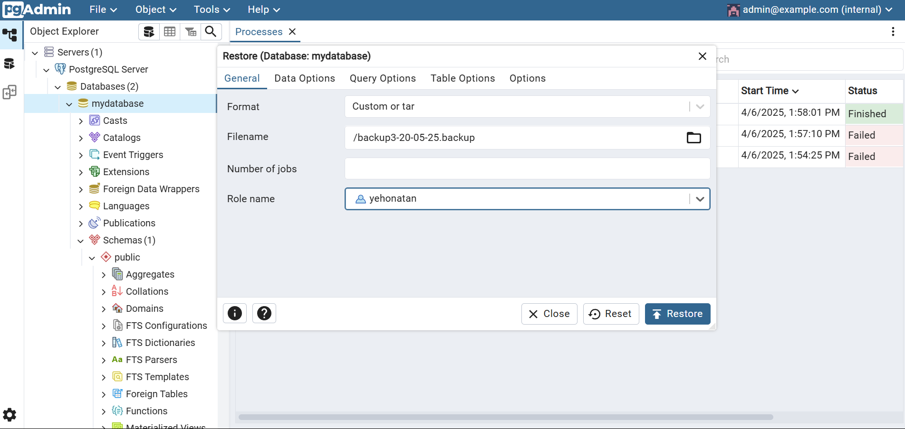


---
## Phase 4 - Programming

we add a new column in medication named 'amount'
in the [Alter table file](Phase4/AlterTable.sql) to store the amount of medication given in each treatment.
```sql
ALTER TABLE treatment_medication
ADD amount int;

UPDATE treatment_medication
SET amount = 1;
```

### First Program
📁 [The First Program File](Phase4/main1.sql)
#### Description
The script is used to add a shift for a staff member and assign a nurse to a department.

Before running the first part, the shift table looks like this:
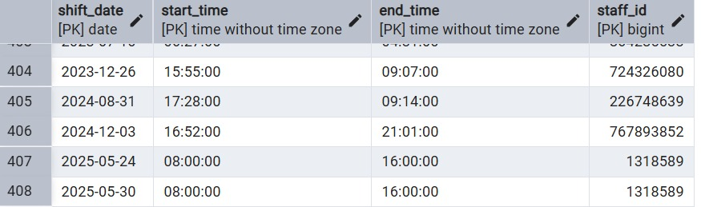

After running the first part, the shift table looks like this:
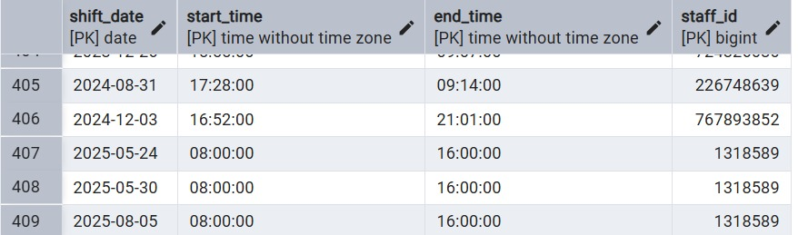

The second part returns an exception:
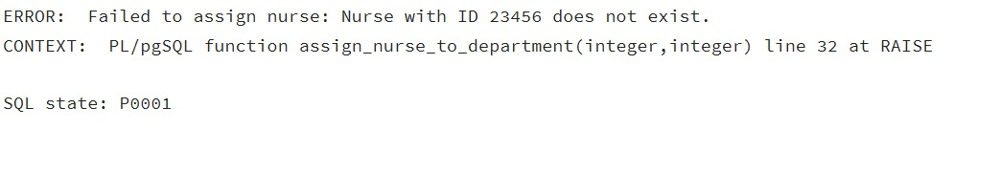

### Second Program
📁 [The Second Program File](Phase4/main2.sql)
#### Description
The script file is used to calculate doctor drug usage and update equipment stock.

The first part returns the number of drugs used by each doctor:

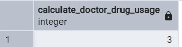


Before the second part, the equipment stock table looks like this:
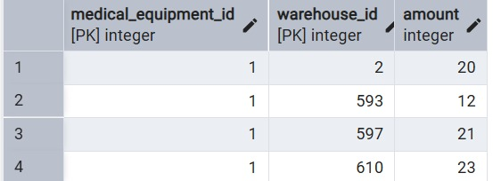

After the second part, the equipment stock table looks like this:
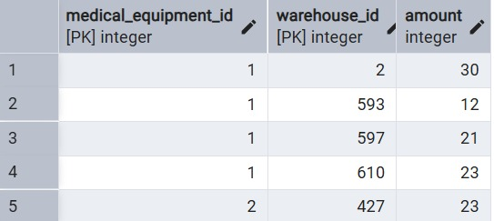

### Backup and Restore 4
Database backups include the programming data structure to ensure complete recovery when needed.
📂 [Go to Backup Directory](Backup)
#### Backup Process
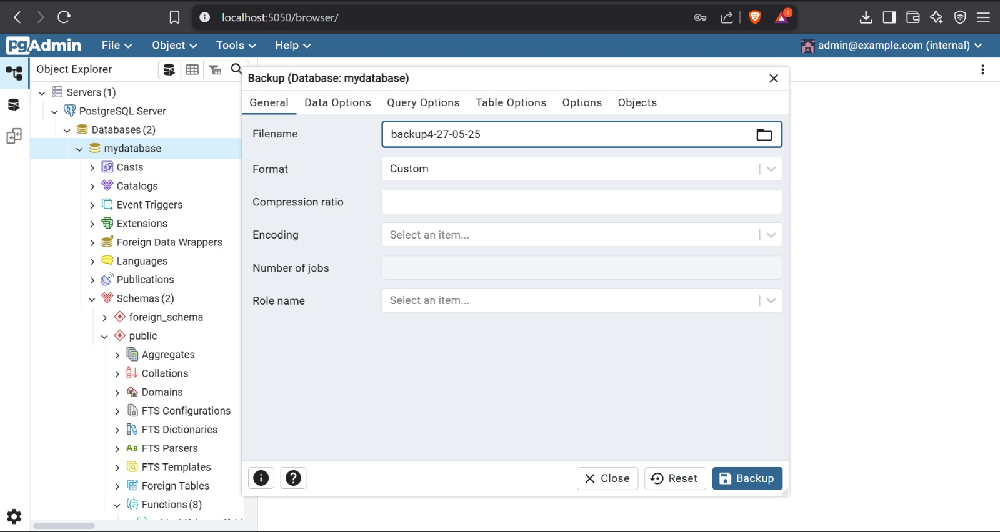
#### Restore Process
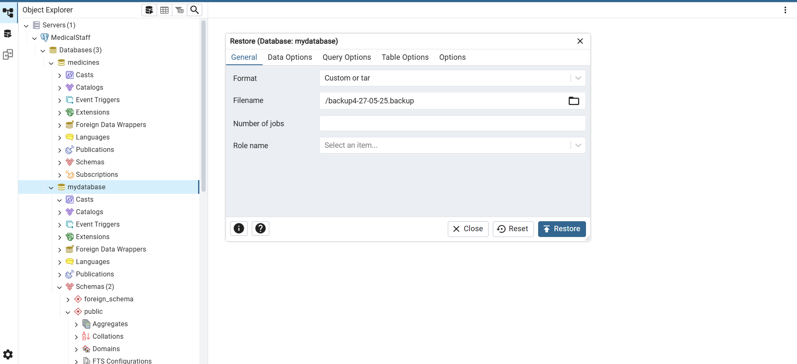

---

## Phase 5 - Hospital Management Application

### Running Instructions

1. **Start the Backend Server:**
   - Navigate to `Phase5/backend` and run:
     ```bash
     npm install
     npm run dev
     ```
   - The server will run on port 3001.

2. **Start the Frontend (React App):**
   - Navigate to `Phase5` and run:
     ```bash
     npm install
     npm start
     ```
   - The app will be available at: http://localhost:5173

3. **Login Credentials:**
   - Username: `Yehonatan` Password: `12345678`
   - Username: `Maor` Password: `12345678`

### Tools & Technologies Used
- **PostgreSQL** - Relational database
- **Node.js + Express** - Backend server in JavaScript/TypeScript
- **React + TypeScript** - Modern frontend UI
- **Axios** - HTTP requests between frontend and backend
- **TailwindCSS** - Modern, responsive styling
- **pg** - PostgreSQL client for Node.js
- **Other tools:** VSCode, PgAdmin, PowerShell

### File & Folder Structure
- `Phase5/backend` - Backend code (Node.js/Express)
  - `src/routes` - Route files for each entity (patients, departments, medications, queries)
- `Phase5/src/components` - React components for each main screen:
  - `LoginPage.tsx` - Login screen
  - `Dashboard.tsx` - Main dashboard
  - `QueriesSection.tsx` - Queries & procedures screen
  - `PatientsPage.tsx` - Patient management
  - `DepartmentsPage.tsx` - Department management
  - `MedicationsPage.tsx` - Medication management
  - `Navigation.tsx` - Navigation menu
  - `Modal.tsx` - General modals

### Internal Documentation
- Every file and component contains documentation and comments (JS/TS Doc, English and Hebrew where relevant)
- Variable and function names are clear and descriptive
- Each backend route is documented at the top of the file

### Screenshots (replace with actual screenshots)

1. **Login Screen:**
   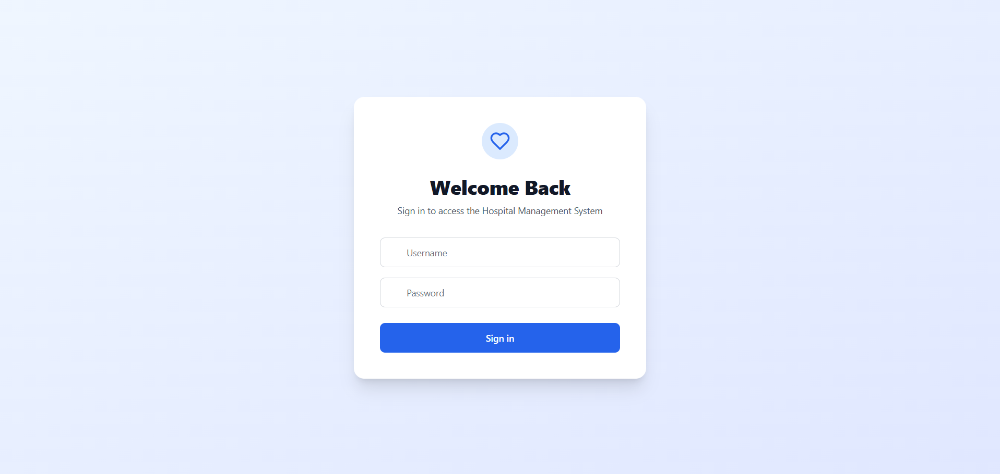
2. **Dashboard:**
   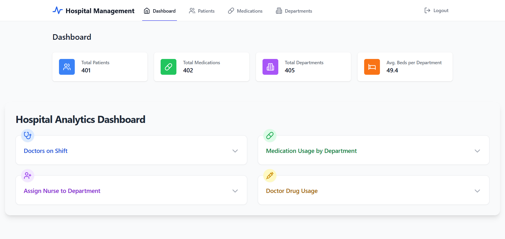
3. **Medications Managment Screen:**
   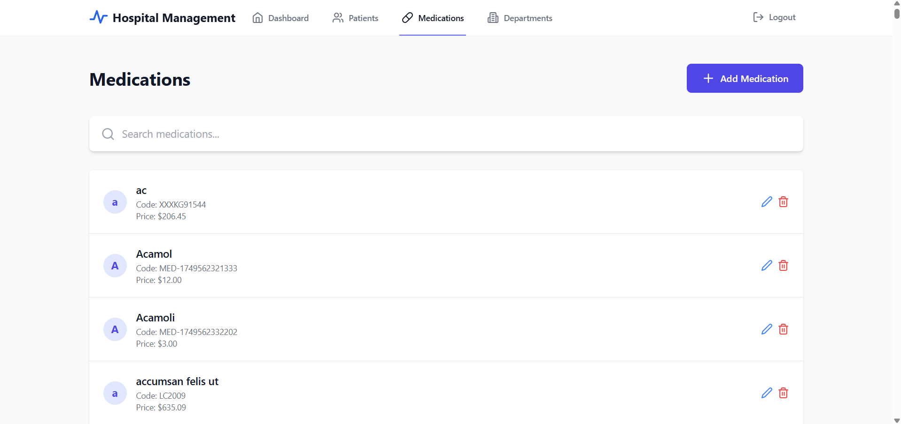
4. **Patients Management Screen:**
   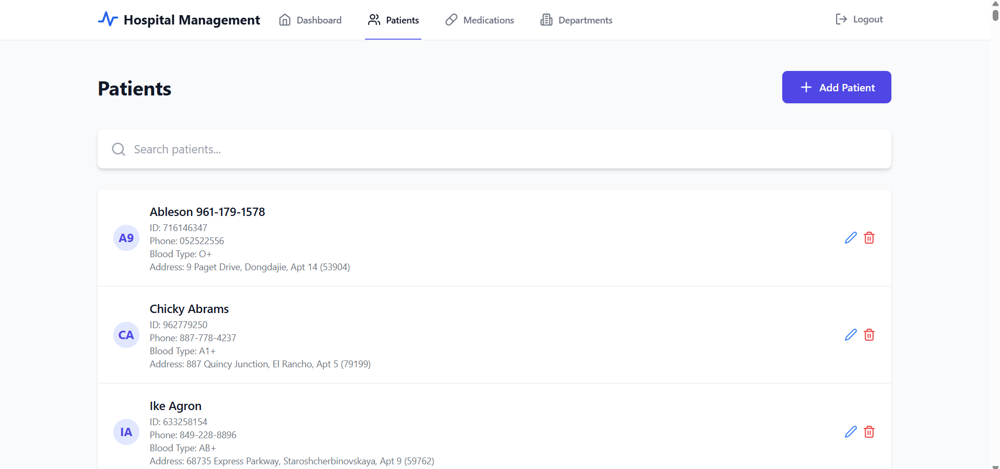
5. **Departments/Medications Screen:**
   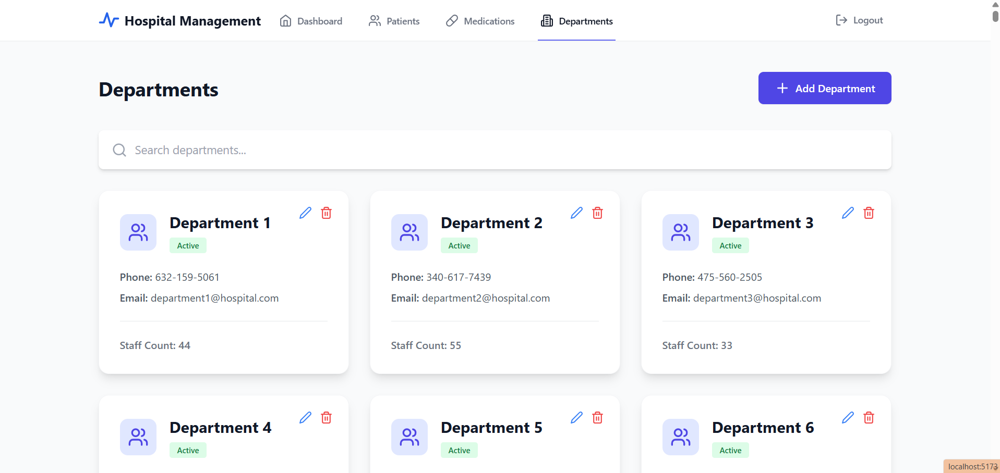


---

For any further questions or explanations about any of the steps, feel free to contact the project authors.
######Yehonatan Yeret && Maor Noy


